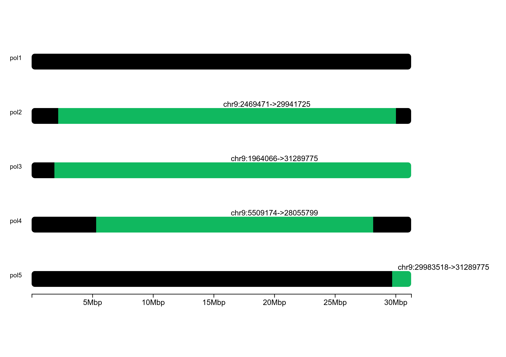

# Introduction

Mounting evidence has shown the benefit of using haplotype variants over single nucleotide polymorphisms (SNPs) in various genetic analyses, including genome-wide association studies, detection of the signatures of positive selection, deducing genetic admixture, introgression, and demographic history. Accurate chromosomal haplotypes are needed to identify causal haplotype variants for further genetic dissection. We recently developed the [Hapi](http://htmlpreview.github.io/?https://github.com/Jialab-UCR/Jialab-UCR.github.io/blob/master/Hapi_manual.html) algorithm to infer chromosome-length haplotypes using the genotypic data of several single gametes. The genomic data of gametes, represented by variants at heterozygous SNP (hetSNP) loci along the individual genome, may be obtained by various flatforms, including whole genome sequencing or genotyping arrays. Multi-stage preprocessing steps, including removal of erroneously genotyped markers and iterative imputation of missing markers, are implemented by *Hapi* when the quality of gamete data is suboptimal. With the rapid advancement of biotechnologies, high-resolution genotyping with negligible errors will be achieved in the foreseeable future. *Here we present a new and advanced chromosome-phasing algorithm, IIIandMe, which only requires three gametes when genotypic data are of high quality. Compared to Hapi, IIIandMe is logically more straightforward and computationally more efficient.*


# IIIandMe package installation

The development version of *IIIandMe* can be easily installed from Github:

```{r install, eval=FALSE, echo=T}
### Install dependencies ahead
install.packages('devtools')

devtools::install_github('Jialab-UCR/IIIandMe')
```

# Haplotype Phasing

The *IIIandMe* phasing method mainly consists of three main steps:

⋅⋅* Data preprocessing
⋅⋅* Haplotype inference & crossover indentification of all possible three-gamete groups
⋅⋅* Haplotype & crossover majority voting among groups

## Data preprocessing

We show an example using the dataset of a citrus accession, Clementine de Nules. The sample data contain the diploid genotypic data for 1314 ordered hetSNPs (5360 raw SNPs) on the 9th chromosome and haploid genotypic data for 5 single pollen grains. This dataset has been deposited and is publicly available in the Citrus Genome Database (https://www.citrusgenomedb.org/). 

```{r raw, echo=TRUE}
### Load sample data

library(IIIandMe)
data(sample)
head(sample)

```

Firstly, ATCG genotypes are coded in a so-called binary format (0/1) in preprocessing step given reference and alternative alleles. Then all hetSNPs are selected based on the diploid genotypes.

```{r pre, echo=TRUE}

input<- PreProcessing(sample)
head(input)

```

## Phasing

### Phasing in groups of three gametes

To preclude the potential error that two gamete chromosomes have a crossover at the same locus, we recommend slightly increasing the sample size, for example, to a set of 5 or 6 gametes. When analyzing 5 gamete chromosomes, there will be 10 (choose 3 out of 5) possible combinations of three gamete chromosomes. One can apply IIIandMe to each of these 10 combinations, yielding 10 sets of inferred haplotypes (most are identical) for the chromosome.

*NOTE: If your data contains many genotyping errors, you could set _filterGenoError = T_. Then genotyping error filtering step in Hapi package would be executed.*

```{r res, include=FALSE}

res<- HapCo(input, 5, filterGenoError = F)
hap<- res[[1]]
co<- res[[2]]
```

The 10 sets of inferred haplotypes and crossover information are stored in _res_ list.

```{r hap, echo=TRUE}
head(hap[[1]])
co[[1]]
```

### Majority voting among groups

The majority-voting is conducted for one more time on these 10 sets of candidate haplotypes, yielding the consensus haplotypes for the chromosome. The _ratio_ output helps users understand how many haplotypes are identical.

```{r vote, echo=TRUE}
vote<- VoteCount(sample, input, res, 5)
hap<- vote[[1]]
co<- vote[[2]]
```

The consensus haplotypes and crossover information are shown below. As the same crossovers may happen many times in all 3-gamete groups, we calculate the occurrence frequency. If the duplication percentage is high, the specific crossover is convincing. Moreover, we annotate if the crossovers are detected again by the final consensus haplotype, which can make the results more solid.

```{r show}
head(hap)
co
```

# Crossover plotting

The visualization function *PlotCo()* is provided here to view haplotypes and crossovers of all gametes from one chromosome.

```{r plot, echo=TRUE, results='hide'}
PlotCo(sample, chr='chr9', co=vote[[2]])
```


# Session info {.unnumbered}

```{r sessionInfo, echo=FALSE}
sessionInfo()
```
